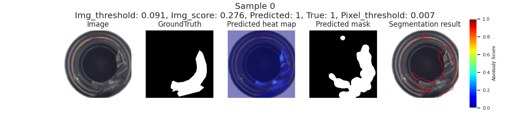

# vq-vae-2-pytorch-ad

The code in this repository corresponds to our paper, Anomaly detection on MVTec AD using VQ-VAE-2, which has been accepted at the [57th CIRP Conference on Manufacturing Systems 2024](https://www.cirpcms2024.org/), 29th to 31st May 2024, Póvoa de Varzim, Portugal.

## Update

* 2020-06-01

train_vqvae.py and vqvae.py now supports distributed training. You can use --n_gpu [NUM_GPUS] arguments for train_vqvae.py to use [NUM_GPUS] during training.

## Requisite

* Python >= 3.6
* PyTorch >= 1.1
* lmdb (for storing extracted codes)

[Checkpoint of VQ-VAE-2 and PixelSnail (top and bottom)](https://drive.google.com/drive/folders/1w4F1YWVz6hJwK3KvkrGZSgJKTXkZ1qkB?usp=drive_link)

## Usage

Currently supports 256px (top/bottom hierarchical prior)

1. [Register](https://www.mvtec.com/company/research/datasets/mvtec-ad) and download the whole MVTec dataset; it's about 4.9 GB size so make sure you have enough space.

2. Run the following script from the home directory which combines all the images into one category and renames them:
> python scripts/copyAllCategoriesToOneFolder.py 

3. Stage 1 (VQ-VAE)

> python train_vqvae.py mvtec_anomaly_detection/all/train --resize 292 --centerCrop 256 --randomCrop 282 --randomRotation 2 --epoch 1000 --n_gpu 4 --batch 512

If you have access to more than 1 GPU, adjust the value accordingly; the more GPUs you have the larger the batch size can be which reduces the total training time.

4. Extract codes for stage 2 training

> python extract_code.py --ckpt checkpoint/all_vqvae_1000.pt --name lmdb/all/ mvtec_anomaly_detection/all/train/ --gpu

where multiple GPUs were used in Step 3, use the gpu flag; if not, then the no-gpu flag.

5. Stage 2 (PixelSNAIL)

To train the top prior:

> python train_pixelsnail.py lmdb/all --epoch 500 --lr 1e-4 --hier top --batch 64 --channel 128 --n_res_channel 128

and the bottom prior:

> python train_pixelsnail.py lmdb/all --epoch 500 --lr 1e-4 --hier bottom --batch 64 --channel 512

All the GPUs that are available will be used.

6. Anomaly detection

> python anomaly_detection.py --resize 292 --centerCrop 256 --randomCrop 282 --randomRotation 2 --batch 167 --top checkpoint/all_pixelsnail_top_500.pt --bottom checkpoint/all_pixelsnail_bottom_500.pt --vqvae checkpoint/all_vqvae_1000.pt --data_path mvtec_anomaly_detection --class_name [class_name] --gpu

where [class_name] corresponds to the individual object and texture categories; the gpu flag has the same interpretation as in step 4. 
It only uses a single GPU so you can use the [helper bash scripts](scripts/anomaly_detection_GPU0.sh) to run across multiple GPUs and cycle through each of the categories.

## Sample result

## Contact

For any questions or issues, please feel free to open an issue in this repository or [contact us](edwardyapp01@gmail.com) directly.

Thank you for your interest in our work!
